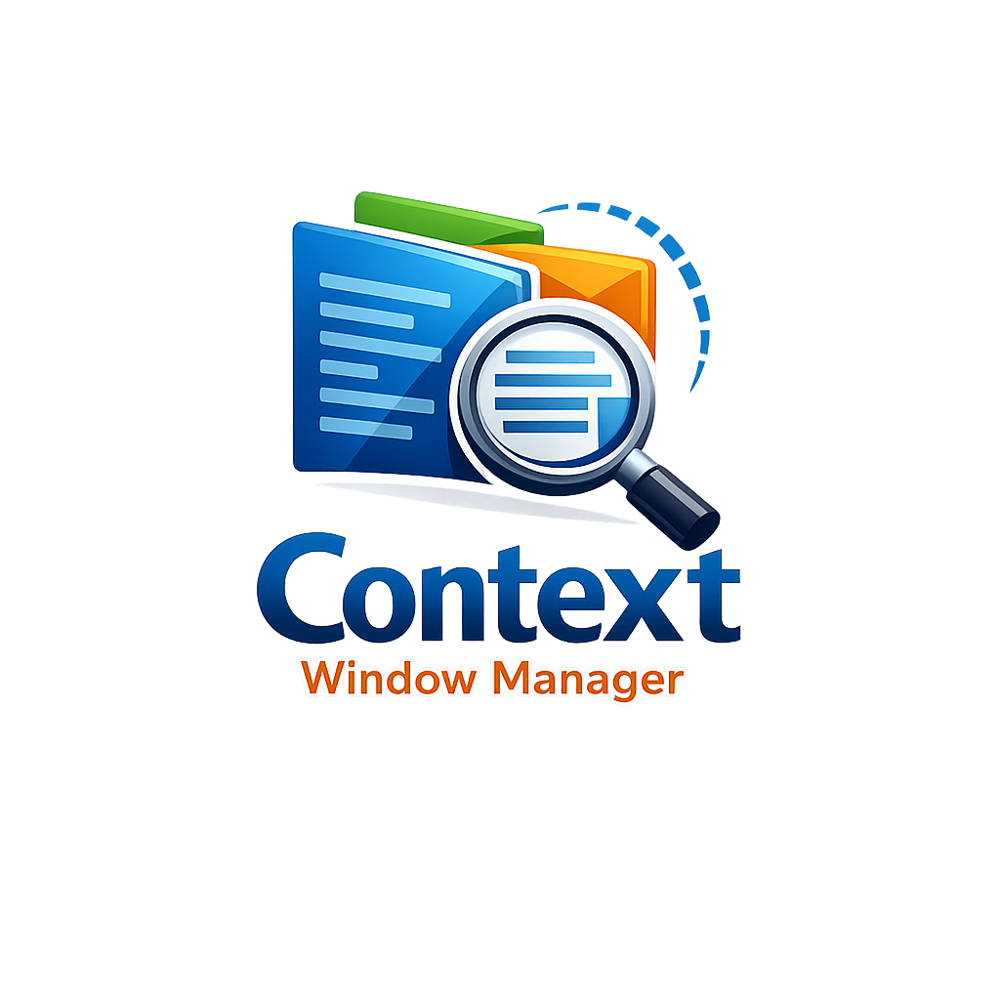

<p align="center">
  <a href="README.ja.md">日本語</a> | <a href="README.zh.md">中文</a> | <a href="README.es.md">Español</a> | <a href="README.fr.md">Français</a> | <a href="README.hi.md">हिन्दी</a> | <a href="README.it.md">Italiano</a> | <a href="README.pt-BR.md">Português (BR)</a>
</p>

<p align="center">
  
</p>

<p align="center">
  <a href="https://github.com/mcp-tool-shop-org/context-window-manager/actions/workflows/ci.yml"></a>
  <a href="https://pypi.org/project/cwm-mcp/"></a>
  <a href="LICENSE"></a>
  <a href="https://mcp-tool-shop-org.github.io/context-window-manager/"></a>
</p>

> **Lossless context restoration for LLM sessions via KV cache persistence**

---

## What is this?

Context Window Manager (CWM) is an MCP server that solves the **context exhaustion problem** in LLM applications. Instead of losing your conversation history when context fills up, CWM lets you:

- **Freeze** your current context to persistent storage
- **Thaw** it back later with zero information loss
- **Clone** contexts to explore different conversation branches
- **Resume** exactly where you left off

Unlike summarization or RAG approaches, CWM preserves the actual KV cache tensors, giving you **true, lossless restoration**.

---

## How it works

```
Traditional Approach (Lossy):
┌─────────────────────────────────────────────┐
│ Context fills up → Summarize → Lose details │
└─────────────────────────────────────────────┘

CWM Approach (Lossless):
┌──────────────────────────────────────────────────────────────┐
│ Context fills up → Freeze KV cache → Store tensors → Thaw   │
│                                                    ↓        │
│                              Exact restoration, zero loss   │
└──────────────────────────────────────────────────────────────┘
```

CWM leverages:
- **vLLM's prefix caching** with `cache_salt` for session isolation
- **LMCache** for tiered KV cache storage (GPU → CPU → Disk → Redis)
- **MCP protocol** for seamless integration with Claude Code and other MCP clients

---

## Quick Start

### Prerequisites

- Python 3.11+
- vLLM server with prefix caching enabled
- LMCache configured with vLLM

### Installation

```bash
pip install cwm-mcp
```

### Configuration

Add to your Claude Code settings (`.claude/settings.json`):

```json
{
  "mcpServers": {
    "context-window-manager": {
      "command": "python",
      "args": ["-m", "context_window_manager"],
      "env": {
        "CWM_VLLM_URL": "http://localhost:8000"
      }
    }
  }
}
```

### Usage

```
# Freeze your current session
> window_freeze session_abc123 my-coding-project

# Later, restore it
> window_thaw my-coding-project

# List all saved windows
> window_list

# Check status
> window_status my-coding-project
```

---

## Features

### Core Operations

| Tool | Description |
|------|-------------|
| `window_freeze` | Snapshot session context to storage |
| `window_thaw` | Restore context from a saved window |
| `window_list` | List available context windows |
| `window_status` | Get detailed session/window info |
| `window_clone` | Branch a context for exploration |
| `window_delete` | Remove a saved window |

### Storage Tiers

CWM automatically manages storage across tiers:

1. **CPU Memory** - Fast, limited capacity
2. **Disk** - Large capacity, compressed
3. **Redis** - Distributed, shared across instances

### Session Isolation

Each session gets a unique `cache_salt`, ensuring:
- No cross-session data leakage
- Protection against timing attacks
- Clean separation of contexts

---

## Documentation

| Document | Description |
|----------|-------------|
| [USER_GUIDE.md](docs/USER_GUIDE.md) | Getting started and workflows |
| [API.md](docs/API.md) | Complete API reference |
| [ARCHITECTURE.md](docs/ARCHITECTURE.md) | Technical architecture deep-dive |
| [SECURITY.md](docs/SECURITY.md) | Security considerations |
| [ERROR_HANDLING.md](docs/ERROR_HANDLING.md) | Error taxonomy and handling |
| [ROADMAP.md](docs/ROADMAP.md) | Development phases and milestones |
| [CONTRIBUTING.md](docs/CONTRIBUTING.md) | Development guidelines |

---

## Requirements

### vLLM Server Configuration

```bash
vllm serve "meta-llama/Llama-3.1-8B-Instruct" \
  --enable-prefix-caching \
  --kv-transfer-config '{"kv_connector":"LMCacheConnectorV1","kv_role":"kv_both"}'
```

### LMCache Environment

```bash
export LMCACHE_USE_EXPERIMENTAL=True
export LMCACHE_LOCAL_CPU=True
export LMCACHE_MAX_LOCAL_CPU_SIZE=8.0
```

---

## Development

```bash
# Clone and setup
git clone https://github.com/mcp-tool-shop-org/context-window-manager.git
cd context-window-manager
python -m venv .venv
.venv\Scripts\activate  # Windows
pip install -e ".[dev]"

# Run tests
pytest tests/unit/

# Run with coverage
pytest tests/unit/ --cov=src/context_window_manager
```

See [CONTRIBUTING.md](docs/CONTRIBUTING.md) for detailed guidelines.

---

## Roadmap

- [x] Phase 0: Documentation & Architecture
- [x] Phase 1: Core Infrastructure
- [x] Phase 2: MCP Server Shell
- [x] Phase 3: Freeze Implementation
- [x] Phase 4: Thaw Implementation
- [x] Phase 5: Advanced Features (clone, auto-freeze)
- [x] Phase 6: Production Hardening
- [x] Phase 7: Integration & Polish

See [ROADMAP.md](docs/ROADMAP.md) for details.

---

## License

MIT License - see [LICENSE](LICENSE) for details.

---

## Acknowledgments

- [vLLM](https://github.com/vllm-project/vllm) - High-throughput LLM serving
- [LMCache](https://github.com/LMCache/LMCache) - KV cache persistence layer
- [Model Context Protocol](https://modelcontextprotocol.io/) - Integration standard
- [Recursive Language Models](https://arxiv.org/abs/2512.24601) - Inspiration for context management

---

## Status

**Beta (v0.6.4)** - Production hardening complete. CI consolidated (2 workflows). 366 tests passing.
